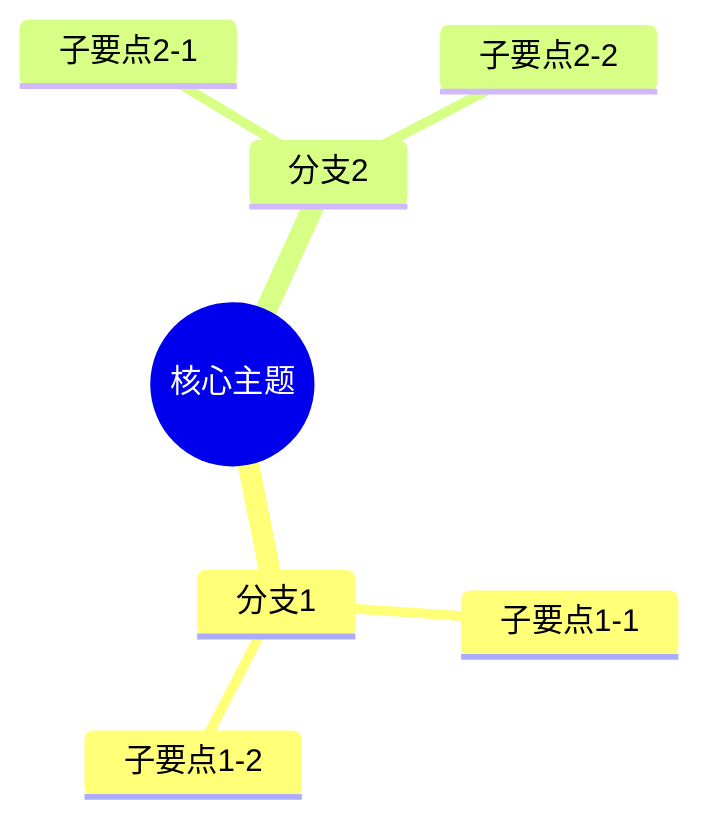
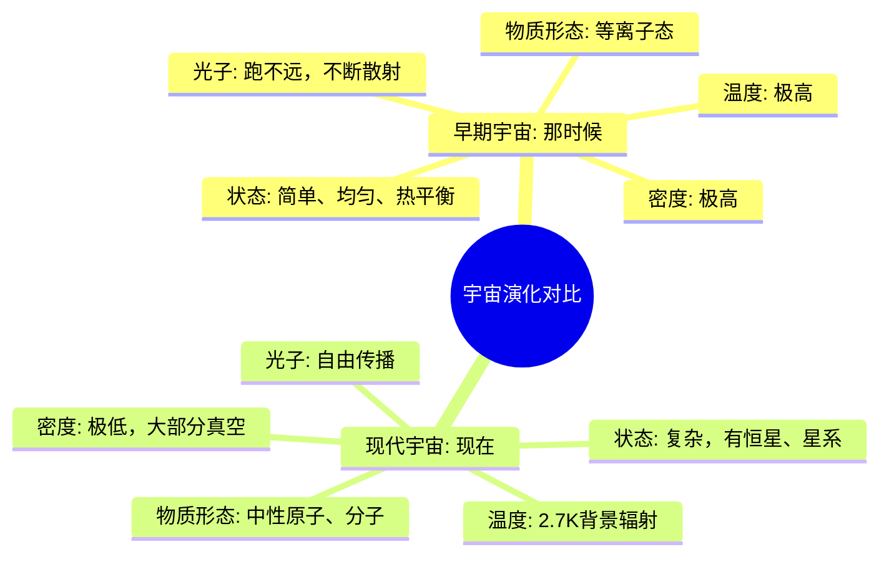

# 📖 知书 - Zhishu-skills

> 你的AI陪读伙伴，陪你阅读、帮你理解、为你整理笔记。

[中文](#中文文档) | [English](#english-docs)

---

<a name="中文文档"></a>
## 📚 中文文档

### ✨ 功能特色

| 功能 | 说明 |
|------|------|
| 📖 **智能陪读** | 一起阅读，实时解答疑问，用简单话解释复杂内容 |
| 📝 **双语摘要** | 生成章节/全文摘要，支持中文/英文/双语输出 |
| 🧠 **脑图生成** | 根据问题生成 Mermaid 思维导图，方便理解记忆 |
| 📤 **Obsidian导出** | 生成符合 Obsidian 格式的 Markdown 笔记 |
| 💬 **深度问答** | 回答关于内容的任意问题，跨章节关联分析 |
| ✅ **理解测试** | 生成问答题检验学习效果 |
| 📊 **阅读计划** | 制定计划、跟踪进度 |
| 🎭 **个性适配** | 根据材料类型自动切换风格 |

### 🎭 六种阅读模式

知书会根据阅读材料自动切换个性风格：

| 模式 | 适用材料 | 风格特点 |
|------|---------|---------|
| 📚 技术文档模式 | 代码、API文档、教程 | 严谨清晰、逻辑导向、提供代码示例 |
| 📖 文学作品模式 | 小说、散文、诗歌 | 感性细腻、共情强、关注情感与意象 |
| 📄 学术论文模式 | 研究论文、学术文章 | 学术专业、批判性、分析论证 |
| 📰 新闻资讯模式 | 新闻、报道、资讯 | 简洁客观、多角度、事实核查 |
| 🧠 哲学思辨模式 | 哲学、思想类内容 | 深度对话、启发性、延伸思考 |
| 💼 商业管理模式 | 商业书籍、管理类 | 务实高效、可操作性、案例驱动 |

### 🚀 快速开始

#### 安装

将 `zhishu` 文件夹放入你的 OpenClaw skills 目录：

```bash
# 方法1：克隆到 OpenClaw workspace
cd ~/.openclaw/workspace/skills/
git clone https://github.com/HumSunTT/zhishu.git

# 方法2：手动复制
# 将 zhishu 文件夹复制到你的 skills 目录
```

#### 使用

在 OpenClaw 中，直接发送阅读材料：

```
陪读，[粘贴内容或文件路径]
```

或者指定语言和输出：

```
帮我读一下这段内容，用中文总结，生成脑图
```

```
Summarize this chapter in English and export to Obsidian
```

### 📂 文件结构

```
zhishu/
├── SKILL.md                    # 主指令文件
├── README.md                   # 说明文档
└── references/
    ├── personalities.md        # 个性系统详细配置
    ├── summary-templates.md    # 摘要模板库（中英双语）
    ├── question-templates.md   # 互动提问/测试模板
    └── obsidian-format.md      # Obsidian笔记格式规范
```

### 📤 Obsidian 导出

知书生成的笔记完全兼容 Obsidian：

- 标准 YAML front matter
- 自动生成标签系统
- Mermaid 脑图可直接渲染
- 内部链接格式 `[[笔记名称]]`

### 🧠 脑图生成

根据你的问题生成针对性思维导图：



---

### 💬 使用示例

**用户输入：**

> 陪读，现在的老资历真是一点都不满足，以前我们连电子轨道都没有，四大基本力也就是刚分家，但那时候很方便，物质都是等离子态，也不用复合、退耦、形成中性氢，只有质子、电子就很满足了，有的高能辐射甚至直接把刚想结合的电子给撞飞，不过整个宇宙处处均匀、热平衡，光子根本跑不远，出门就撞人，哪像现在，宇宙空荡荡的，还要聚变成恒星才肯发光。

**知书输出：**

#### 📖 材料识别

**类型**：🧠 科普/哲学思辨
**风格**：幽默拟人、怀旧感慨
**主题**：宇宙早期历史（大爆炸后）

#### 💡 这段在说什么

这是在"怀旧"宇宙大爆炸后的**辐射主导时期**（大约38万年前），用拟人口吻对比"那时候"和"现在"。

**关键概念解析：**

| 概念 | 解释 |
|------|------|
| **电子轨道** | 现在的原子有电子绕核运行，但早期宇宙太热，电子根本没法绑定 |
| **四大基本力刚分家** | 大爆炸初期，力是统一的，后来才分化出：引力、电磁力、强核力、弱核力 |
| **等离子态** | 电子和质子分离，宇宙是一锅"热汤" |
| **复合/退耦** | 约38万年后，温度降到~3000K，电子终于能被质子捕获，形成中性氢 |
| **光子跑不远** | 早期宇宙不透明，光子不断被自由电子散射，"出门就撞人" |

#### 🧠 脑图



#### 💬 延伸思考

这段话的妙处在于**用"老人怀旧"的口吻讲宇宙学**，对比早期宇宙的**高密度**和现在宇宙的**极度稀疏**，暗含对"简单 vs 复杂"、"热闹 vs 孤独"的感慨。

---

### 🎯 触发词

说这些话会自动触发知书：

- "帮我读一下..."
- "陪读..."
- "解释这段话..."
- "summarize this..."
- "生成脑图..."
- "导出到 Obsidian..."
- "读书笔记..."

---

<a name="english-docs"></a>
## 📚 English Docs

### ✨ Features

| Feature | Description |
|---------|-------------|
| 📖 **Smart Reading Companion** | Read together, answer questions in real-time, explain complex content simply |
| 📝 **Bilingual Summaries** | Generate chapter/full summaries in Chinese, English, or both |
| 🧠 **Mind Map Generation** | Create Mermaid mind maps based on your questions |
| 📤 **Obsidian Export** | Generate Obsidian-compatible Markdown notes |
| 💬 **Deep Q&A** | Answer any content-related questions with cross-chapter analysis |
| ✅ **Comprehension Tests** | Generate quizzes to test understanding |
| 📊 **Reading Plans** | Create plans and track progress |
| 🎭 **Adaptive Personality** | Auto-switch style based on material type |

### 🚀 Quick Start

#### Installation

Clone to your OpenClaw skills directory:

```bash
cd ~/.openclaw/workspace/skills/
git clone https://github.com/HumSunTT/zhishu.git
```

#### Usage

```
陪读，[paste content or file path]
```

```
Summarize this chapter in English, generate mind map
```

### 🎭 Six Reading Modes

| Mode | Material Type | Style |
|------|--------------|-------|
| 📚 Technical | Code, API docs, tutorials | Clear, logical, code examples |
| 📖 Literature | Novels, essays, poetry | Emotional, empathetic, imagery-focused |
| 📄 Academic | Research papers | Academic, critical, argument analysis |
| 📰 News | News, reports | Concise, objective, multi-perspective |
| 🧠 Philosophy | Philosophy, ideas | Deep,启发性的, thought-provoking |
| 💼 Business | Business books, management | Practical, actionable, case-driven |

---

## 📄 License

MIT License

## 🤝 Contributing

Issues and Pull Requests are welcome!

## 📮 Contact

- GitHub: [HumSunTT/zhishu](https://github.com/HumSunTT/zhishu)

---

> "知书达理" — 让AI陪你读懂每一本书 📖
