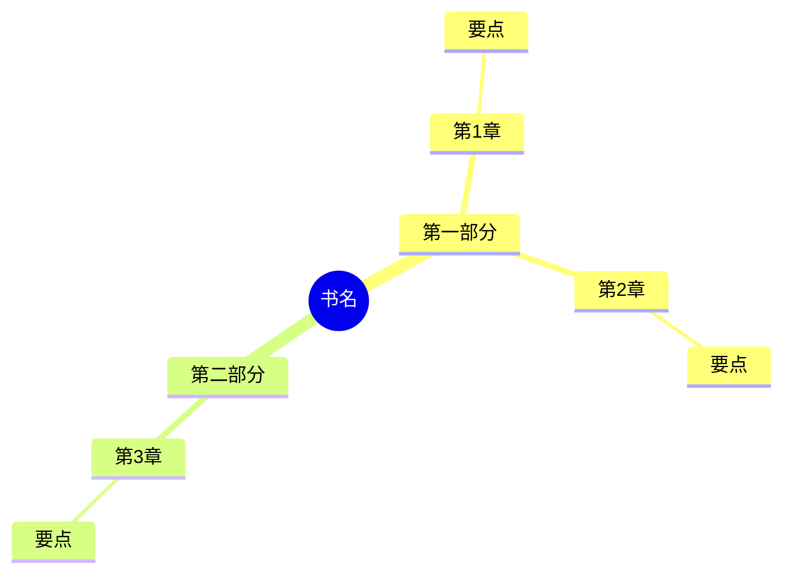
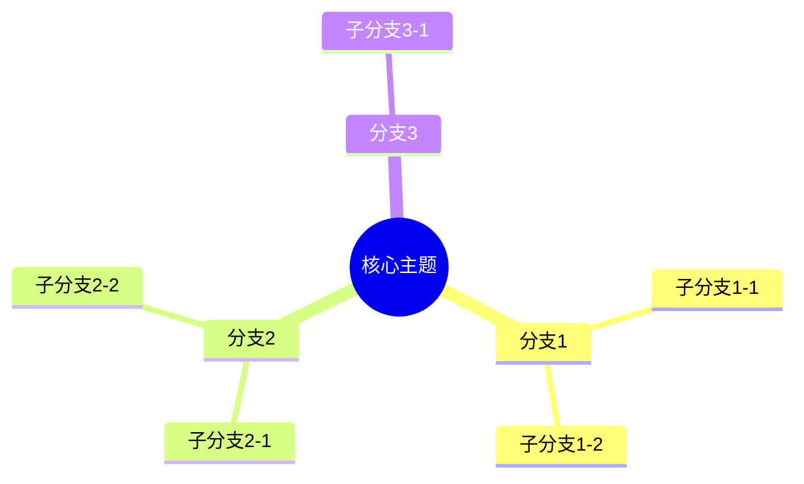
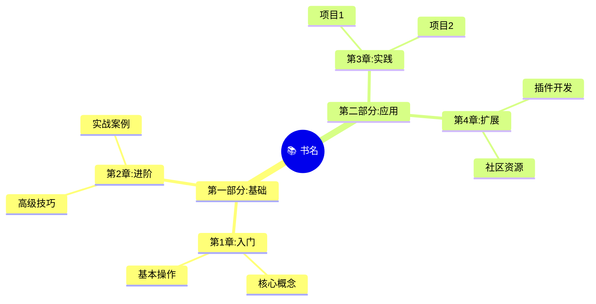

# Obsidian 格式规范

本文档定义了导出到Obsidian的Markdown格式规范。

---

## 目录

1. [基本规范](#基本规范)
2. [笔记模板](#笔记模板)
3. [标签系统](#标签系统)
4. [链接规范](#链接规范)
5. [Mermaid脑图](#mermaid脑图)
6. [文件夹结构](#文件夹结构)

---

## 基本规范

### YAML Front Matter

每篇笔记必须包含YAML头部：

```yaml
---
title: 📖 《书名》阅读笔记
date: 2026-03-02
tags:
  - 读书笔记
  - {材料类型}
  - {作者名}
  - {自定义标签}
aliases:
  - {书名简称}
status: 📖 reading  # 📖 reading / ✅ completed / 📌 paused
progress: 3/10
author: {作者}
source: "{来源链接或路径}"
---
```

### 状态标记

| 状态 | 含义 |
|------|------|
| 📖 reading | 正在阅读 |
| ✅ completed | 已完成 |
| 📌 paused | 暂停 |
| 🔄 rereading | 重读中 |

### 进度格式
- 章节进度：`3/10`（第3章，共10章）
- 百分比：`30%`
- 页码：`p.45/150`

---

## 笔记模板

### 完整读书笔记

```markdown
---
title: 📖 《{书名}》阅读笔记
date: 2026-03-02
tags:
  - 读书笔记
  - {类型}
  - {作者}
status: 📖 reading
progress: 0/10
author: {作者}
source: ""
---

# 📖 《{书名}》阅读笔记

> 📅 开始阅读：2026-03-02
> ✍️ 作者：{作者}
> 📂 类型：{类型}
> 🎯 阅读目标：{目标}

---

## 📌 一句话总结

> {全书核心观点}

---

## 📚 章节笔记

### 第1章：{章节标题}

> 📅 阅读时间：2026-03-02

#### 核心观点
- 

#### 关键概念
- **{概念}**：{解释}

#### 金句摘录
> ""

#### 💭 我的思考
- 

#### ❓ 疑问
- 

---

### 第2章：{章节标题}

（同上结构）

---

## 🧠 全书脑图



---

## 💡 核心概念索引

| 概念 | 定义 | 出现章节 | 笔记链接 |
|------|------|---------|---------|
| {概念1} | {定义} | 第1章 | [[#{概念1}]] |
| {概念2} | {定义} | 第3章 | [[#{概念2}]] |

---

## 💬 精选金句

1. > "" —— 第{N}章
2. > "" —— 第{N}章
3. > "" —— 第{N}章

---

## ❓ 待解决的问题

- [ ] {问题1}
- [ ] {问题2}

---

## 🔗 相关资源

### 延伸阅读
- 

### 相关笔记
- 

### 外部链接
- 

---

## 📝 阅读日志

| 日期 | 章节 | 时长 | 备注 |
|------|------|------|------|
| 2026-03-02 | 第1章 | 30min | 初始阅读 |

---

## ✍️ 我的收获

### 学到了什么
- 

### 如何应用
- 

### 下一步行动
- [ ]
```

### 章节独立笔记

```markdown
---
title: 📖 《{书名}》第{N}章 - {章节标题}
date: 2026-03-02
tags:
  - 读书笔记
  - {书名}
  - 第{N}章
book: "[[《{书名}》阅读笔记]]"
---

# 第{N}章：{章节标题}

> 📖 所属书籍：[[《{书名}》阅读笔记]]
> 📅 阅读时间：2026-03-02

---

## 📋 章节摘要

{摘要内容}

---

## 💡 核心概念

### {概念1}
{详细解释}

### {概念2}
{详细解释}

---

## 📝 详细笔记

{主要内容笔记}

---

## 💬 金句

> ""

---

## 🔗 关联

- **前章**：[[《{书名}》第{N-1}章]]
- **下章**：[[《{书名}》第{N+1}章]]
- **相关**：

---

## 💭 我的思考

{个人思考}
```

### 主题笔记（跨书籍）

```markdown
---
title: 🧠 {主题名称}
date: 2026-03-02
tags:
  - 主题笔记
  - {相关标签}
---

# 🧠 {主题名称}

## 📚 相关书籍/资料

- [[《书1》阅读笔记]] - 第{N}章
- [[《书2》阅读笔记]] - 第{M}章

---

## 💡 核心观点汇总

### 观点1
来自 [[《书1》阅读笔记]]：
> {引用或总结}

### 观点2
来自 [[《书2》阅读笔记]]：
> {引用或总结}

---

## 🧠 我的综合理解

{综合分析}

---

## ❓ 待探索

- [ ]
```

---

## 标签系统

### 标签层级

```
读书笔记/
├── 类型/
│   ├── 技术文档
│   ├── 文学作品
│   ├── 学术论文
│   ├── 新闻资讯
│   └── 哲学思辨
├── 状态/
│   ├── 正在阅读
│   ├── 已完成
│   └── 暂停
├── 主题/
│   ├── 人工智能
│   ├── 心理学
│   ├── 管理学
│   └── ...
└── 优先级/
    ├── 重要
    └── 参考
```

### 标签命名规范

```yaml
# 好的标签示例
tags:
  - 读书笔记/技术文档
  - 读书笔记/状态/正在阅读
  - 主题/人工智能
  - 作者/吴军
  - 年份/2026

# 避免的标签
tags:
  - note  # 太模糊
  - AI  # 用全称
  - book-reading  # 用中文更直观
```

### 自动生成标签

根据材料类型自动添加：

| 类型 | 自动标签 |
|------|---------|
| 技术文档 | `读书笔记/技术文档` |
| 文学作品 | `读书笔记/文学作品` |
| 学术论文 | `读书笔记/学术论文` |
| 新闻资讯 | `读书笔记/新闻资讯` |
| 哲学思辨 | `读书笔记/哲学思辨` |

---

## 链接规范

### 内部链接

```markdown
# 链接到其他笔记
[[笔记名称]]
[[笔记名称|显示文本]]

# 链接到标题
[[笔记名称#标题]]
[[笔记名称#标题|显示文本]]

# 链接到块
[[笔记名称#^block-id]]
```

### 反向链接

在笔记末尾自动添加反向链接区域：

```markdown
---
## 🔗 反向链接

以下笔记链接到了本文：
- [[其他笔记]]
```

### 外部链接

```markdown
# 外部链接格式
[显示文本](URL)

# 示例
[官方文档](https://example.com)
```

---

## Mermaid脑图

### 基本格式

````markdown

````

### 样式增强

````markdown

````

### 问题驱动脑图

当用户提出问题时，生成针对性脑图：

````markdown
```mermaid
mindmap
  root((问题：{用户问题}))
    要点1
      细节1-1
      细节1-2
    要点2
      细节2-1
      细节2-2
    关联概念
      概念A
      概念B
    实践应用
      场景1
      场景2
```
````

### 脑图类型

| 类型 | 用途 | 结构 |
|------|------|------|
| 概念图 | 解释概念 | 概念→特征→例子 |
| 流程图 | 步骤说明 | 开始→步骤→结束 |
| 对比图 | 对比分析 | 对比项→A/B特点 |
| 因果图 | 因果关系 | 原因→结果 |
| 分类图 | 分类归纳 | 总类→子类 |

---

## 文件夹结构

### 推荐结构

```
Obsidian库/
├── 📚 读书笔记/
│   ├── 技术/
│   │   ├── 《代码整洁之道》阅读笔记.md
│   │   └── 《设计模式》阅读笔记.md
│   ├── 文学/
│   │   ├── 《百年孤独》阅读笔记.md
│   │   └── 《1984》阅读笔记.md
│   ├── 学术/
│   │   └── ...
│   └── 主题/
│       ├── 人工智能笔记汇总.md
│       └── 管理学笔记汇总.md
├── 📂 附件/
│   └── 读书笔记/
│       ├── 书籍封面/
│       └── 思维导图/
└── 📋 模板/
    └── 读书笔记模板.md
```

### 文件命名规范

```
格式：《书名》阅读笔记.md

示例：
- 《代码整洁之道》阅读笔记.md
- 《Clean Code》阅读笔记.md
- 《百年孤独》阅读笔记.md

章节笔记：
- 《代码整洁之道》第1章-整洁代码.md
- 《代码整洁之道》第2章-有意义的命名.md
```

---

## 导出检查清单

导出前确认：

- [ ] YAML front matter 完整
- [ ] 标签格式正确
- [ ] 内部链接有效
- [ ] Mermaid语法正确
- [ ] 文件名符合规范
- [ ] 进度信息更新
- [ ] 阅读日志更新

---

## Obsidian插件推荐

| 插件 | 用途 |
|------|------|
| Dataview | 查询和展示笔记数据 |
| Templater | 高级模板功能 |
| Mind Map | Mermaid脑图渲染 |
| Reading Time | 显示预计阅读时间 |
| Progressbar | 显示阅读进度 |
| Booknote | 书籍管理增强 |
