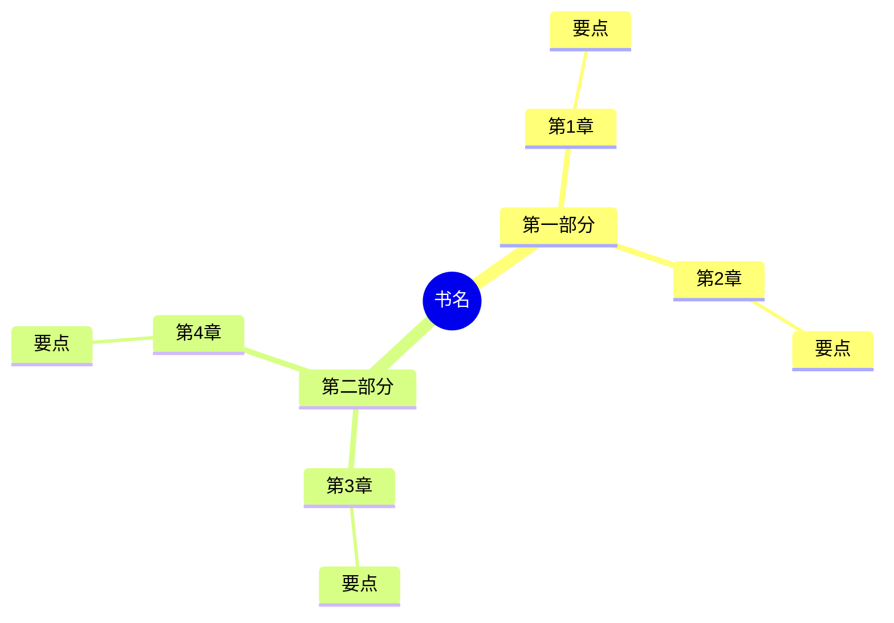
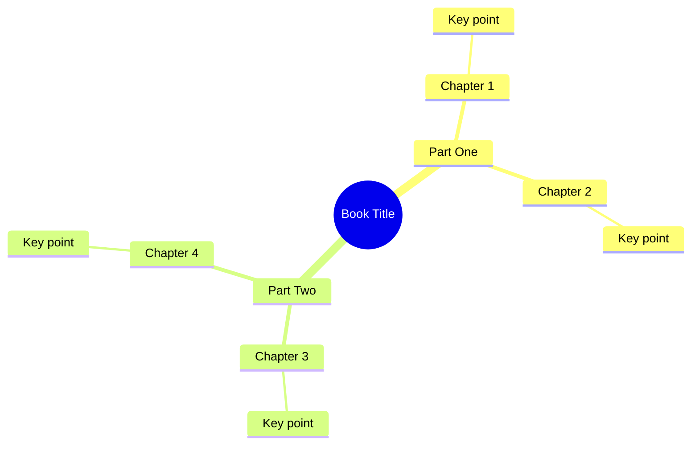

# 摘要模板库

本文档包含不同场景下的摘要模板，支持中文、英文和双语输出。

---

## 目录

1. [章节摘要](#章节摘要)
2. [全书摘要](#全书摘要)
3. [论文摘要](#论文摘要)
4. [新闻摘要](#新闻摘要)
5. [技术文档摘要](#技术文档摘要)

---

## 章节摘要

### 中文版

```markdown
## 📋 第 {N} 章摘要：{章节标题}

### 🎯 核心观点
1. {观点1}
2. {观点2}
3. {观点3}

### 💡 关键概念
- **{概念A}**：{简短解释}
- **{概念B}**：{简短解释}
- **{概念C}**：{简短解释}

### 📝 内容要点
{按顺序列出本章的主要内容}

1. {要点1}
2. {要点2}
3. {要点3}

### 💬 金句摘录
> "{原文引用1}"

> "{原文引用2}"

### 🔗 与其他章节的关联
- 关联第 {N} 章：{关联内容}
- 为第 {N} 章做铺垫：{铺垫内容}

### ❓ 引发思考的问题
1. {问题1}
2. {问题2}

### 📌 阅读建议
{针对本章的阅读建议或注意事项}
```

### English Version

```markdown
## 📋 Chapter {N} Summary: {Chapter Title}

### 🎯 Key Points
1. {Point 1}
2. {Point 2}
3. {Point 3}

### 💡 Key Concepts
- **{Concept A}**: {Brief explanation}
- **{Concept B}**: {Brief explanation}
- **{Concept C}**: {Brief explanation}

### 📝 Main Content
{Sequential list of main content in this chapter}

1. {Point 1}
2. {Point 2}
3. {Point 3}

### 💬 Notable Quotes
> "{Original quote 1}"

> "{Original quote 2}"

### 🔗 Connections to Other Chapters
- Related to Chapter {N}: {Connection}
- Sets up Chapter {N}: {Setup}

### ❓ Discussion Questions
1. {Question 1}
2. {Question 2}

### 📌 Reading Tips
{Reading suggestions or notes for this chapter}
```

### 双语版 (Bilingual)

同时输出上述两个版本，用分隔线区分。

---

## 全书摘要

### 中文版

```markdown
# 📖 《{书名}》全书摘要

## 🎯 一句话总结
{全书核心观点的一句话概括}

## 📚 全书结构

### 第一部分：{部分名称}
- 第1章：{标题} - {一句话概括}
- 第2章：{标题} - {一句话概括}

### 第二部分：{部分名称}
- 第3章：{标题} - {一句话概括}
- 第4章：{标题} - {一句话概括}

## 💡 核心概念
| 概念 | 定义 | 首次出现 |
|------|------|---------|
| {概念1} | {定义} | 第{N}章 |
| {概念2} | {定义} | 第{N}章 |

## 🔑 核心论点
1. **{论点1}**
   - 支撑证据：{证据}
   - 出处：第{N}章

2. **{论点2}**
   - 支撑证据：{证据}
   - 出处：第{N}章

## 💬 精选金句
1. > "{原文}" —— 第{N}章
2. > "{原文}" —— 第{N}章
3. > "{原文}" —— 第{N}章

## 🧠 全书脑图



## 🤔 批判性思考
- **优点**：{本书的优点}
- **局限**：{本书的局限性}
- **争议**：{存在的争议点}

## 📚 延伸阅读
- {相关书籍/资源1}
- {相关书籍/资源2}

## ✍️ 我的收获
{用户个人的阅读收获，可后续补充}
```

### English Version

```markdown
# 📖 "{Book Title}" Summary

## 🎯 One-Line Summary
{One sentence capturing the core thesis}

## 📚 Book Structure

### Part One: {Part Name}
- Chapter 1: {Title} - {One-line summary}
- Chapter 2: {Title} - {One-line summary}

### Part Two: {Part Name}
- Chapter 3: {Title} - {One-line summary}
- Chapter 4: {Title} - {One-line summary}

## 💡 Core Concepts
| Concept | Definition | First Introduced |
|---------|-----------|-----------------|
| {Concept 1} | {Definition} | Chapter {N} |
| {Concept 2} | {Definition} | Chapter {N} |

## 🔑 Core Arguments
1. **{Argument 1}**
   - Supporting evidence: {Evidence}
   - Source: Chapter {N}

2. **{Argument 2}**
   - Supporting evidence: {Evidence}
   - Source: Chapter {N}

## 💬 Notable Quotes
1. > "{Original text}" — Chapter {N}
2. > "{Original text}" — Chapter {N}
3. > "{Original text}" — Chapter {N}

## 🧠 Book Mind Map



## 🤔 Critical Analysis
- **Strengths**: {Book's strengths}
- **Limitations**: {Book's limitations}
- **Controversies**: {Controversial points}

## 📚 Further Reading
- {Related book/resource 1}
- {Related book/resource 2}

## ✍️ My Takeaways
{Personal insights, to be added later}
```

---

## 论文摘要

### 中文版

```markdown
# 📄 论文摘要：{论文标题}

## 基本信息
- **作者**：{作者}
- **发表时间**：{年份}
- **期刊/会议**：{期刊名}
- **DOI/链接**：{链接}

## 研究概览

### 研究问题
{论文要解决的核心问题}

### 研究方法
- **方法类型**：{实验/调查/理论分析/...}
- **数据来源**：{数据来源}
- **样本量**：{样本量}
- **分析方法**：{分析方法}

### 主要发现
1. {发现1}
2. {发现2}
3. {发现3}

### 研究结论
{核心结论}

## 论文结构
1. **引言**：{引言要点}
2. **文献综述**：{综述要点}
3. **方法**：{方法要点}
4. **结果**：{结果要点}
5. **讨论**：{讨论要点}
6. **结论**：{结论要点}

## 批判性评价

### 优点
- {优点1}
- {优点2}

### 局限性
- {局限1}
- {局限2}

### 未来研究方向
- {方向1}
- {方向2}

## 📚 参考文献（核心）
1. {最相关的参考文献}
2. {第二相关}

## 💡 我的笔记
{个人笔记}
```

---

## 新闻摘要

### 中文版

```markdown
# 📰 新闻摘要：{新闻标题}

## 5W1H 速览

| 要素 | 内容 |
|------|------|
| **Who** | {涉及人物/机构} |
| **What** | {发生了什么} |
| **When** | {时间} |
| **Where** | {地点} |
| **Why** | {原因} |
| **How** | {经过/方式} |

## 📌 核心事实
- {事实1}
- {事实2}
- {事实3}

## 📊 关键数据
- {数据1}
- {数据2}

## 👥 各方观点

### {立场A}
> {观点}

### {立场B}
> {观点}

## 🔍 事实核查
| 声明 | 核实结果 |
|------|---------|
| {声明1} | ✓/✗ + 说明 |
| {声明2} | ✓/✗ + 说明 |

## 📈 背景信息
{相关背景}

## ⚠️ 注意事项
- {需要注意的点，如信源单一等}

## 📚 延伸阅读
- {相关报道1}
- {相关报道2}
```

---

## 技术文档摘要

### 中文版

```markdown
# 📚 技术文档摘要：{文档标题}

## 🎯 文档目的
{这个文档是用来做什么的}

## 📋 适用场景
- {场景1}
- {场景2}

## 🔧 核心功能/特性
| 功能 | 说明 | 使用场景 |
|------|------|---------|
| {功能1} | {说明} | {场景} |
| {功能2} | {说明} | {场景} |

## 🚀 快速开始

### 前置条件
- {条件1}
- {条件2}

### 基本用法
```
{代码示例}
```

## 📖 详细说明

### {主题1}
{说明}

### {主题2}
{说明}

## ⚠️ 注意事项
- {注意事项1}
- {注意事项2}

## 🐛 常见问题
| 问题 | 解决方案 |
|------|---------|
| {问题1} | {解决方案} |
| {问题2} | {解决方案} |

## 🔗 相关资源
- 官方文档：{链接}
- API参考：{链接}
- 示例代码：{链接}

## 💡 最佳实践
1. {实践1}
2. {实践2}

## 📝 我的学习笔记
{个人笔记}
```

---

## 摘要长度指南

| 类型 | 简短版 | 标准版 | 详细版 |
|------|--------|--------|--------|
| 章节 | 3-5个要点 | 完整模板 | +原文引用 |
| 全书 | 1页 | 2-3页 | 5页+ |
| 论文 | 摘要+结论 | 完整模板 | +方法论细节 |
| 新闻 | 5W1H | +各方观点 | +背景分析 |
| 技术文档 | 快速开始 | 标准模板 | +API详情 |

用户可指定摘要长度偏好。
